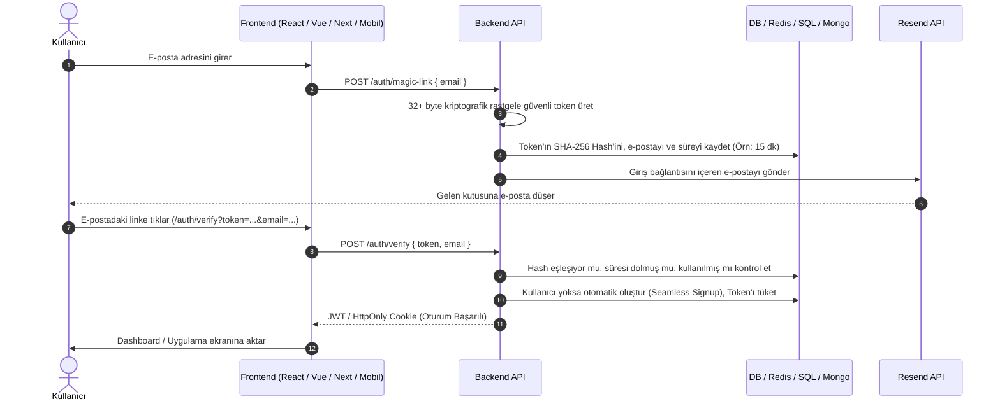

# 📬 Evrensel Magic Link + Resend Entegrasyon Rehberi
*(Herhangi bir Web / Fullstack Projesine Uygulanabilir Standart Referans Dokümanı)*

Bu rehber; **herhangi bir yazılım projesinde** (Node.js, Next.js, Express, Fastify, Python/FastAPI, Go vb.) ve **herhangi bir veritabanında** (PostgreSQL, MySQL, MongoDB, Redis, Prisma, Supabase vb.) şifresiz, tek tıkla e-posta ile kayıt ve giriş (**Magic Link**) mekanizmasını **Resend** altyapısıyla sıfırdan kurmak için hazırlanmış evrensel bir kılavuzdur.

---

## 🧭 1. Temel Mimari ve Çalışma Mantığı

Magic Link mantığı basittir: **"E-postaya erişebilen kişi, hesabın gerçek sahibidir."**



---

## 🔑 2. Ortam Değişkenleri Standardı (`.env`)

Tüm projelerde ortak kullanılacak standart ortam değişkenleri:

```env
# Resend API Anahtarı (https://resend.com/api-keys)
RESEND_API_KEY=re_123456789_abcdef

# E-posta Gönderici Adresi
# Test / Sandbox için:
RESEND_FROM_EMAIL=Uygulama Adi <onboarding@resend.dev>
# Canlı Domain Onayından Sonra:
# RESEND_FROM_EMAIL=Uygulama Adi <auth@senindomainin.com>

# Uygulamanın İstemci (Frontend) URL'i
APP_CLIENT_URL=https://app.senindomainin.com

# Oturum İmzası (JWT / Cookie şifrelemesi için)
AUTH_SECRET=en_az_32_karakterli_guclu_rastgele_bir_gizli_anahtar
```

> ⚠️ **Resend Sandbox Kuralı:** Kendi domainini Resend Dashboard'a ekleyip DNS (DKIM/SPF) kayıtlarını doğrulamayana kadar `onboarding@resend.dev` adresiyle **yalnızca Resend hesabını açtığın e-posta adresine** mail atabilirsin. Canlıya çıkarken domainini onaylatıp kendi adresini kullanmalısın.

---

## 🗃️ 3. Veritabanı Şemaları (SQL & NoSQL & Redis)

Her projede iki temel veriye ihtiyacın vardır: **Kullanıcı Kaydı (`users`)** ve **Doğrulama Jetonu (`magic_tokens`)**.

### A. SQL / PostgreSQL / Prisma
```prisma
model User {
  id          String   @id @default(uuid())
  email       String   @unique
  name        String?
  role        String   @default("user")
  createdAt   DateTime @default(now())
  lastLoginAt DateTime @default(now())
}

model MagicToken {
  id         String   @id @default(uuid())
  email      String
  tokenHash  String   @unique
  expiresAt  DateTime
  used       Boolean  @default(false)
  createdAt  DateTime @default(now())

  @@index([tokenHash])
  @@index([email])
}
```

### B. MongoDB / Mongoose
```javascript
// MagicToken Schema (TTL Index ile süresi dolunca Mongo kendi temizler)
const magicTokenSchema = new mongoose.Schema({
  email: { type: String, required: true, lowercase: true, trim: true },
  tokenHash: { type: String, required: true, index: true },
  expiresAt: { type: Date, required: true, index: { expires: 0 } },
  used: { type: Boolean, default: false }
}, { timestamps: true });
```

### C. Redis (Tamamen Tablosuz / Hafızada)
Veritabanında tablo açmak istemiyorsan Redis mükemmel bir alternatiftir:
```bash
# Key formatı: magic:{tokenHash} -> { "email": "user@example.com" }
# EX: 900 (15 dakika sonra Redis kendiliğinden siler)
SET magic:a3f8c... '{"email":"user@example.com"}' EX 900
```

---

## 🛡️ 4. Evrensel Güvenlik İlkeleri (Asla Atlanmaması Gerekenler)

| Kural | Neden Gerekli? | Nasıl Uygulanır? |
| :--- | :--- | :--- |
| **Token Hashing** | Veritabanı sızsa bile saldırganlar aktif linklerle oturum açamaz. | URL'de ham `rawToken` taşınır, DB'ye `sha256(rawToken)` kaydedilir. |
| **Tek Kullanımlık (Single-Use)** | Link tarayıcı geçmişinden veya ağ kayıtlarından tekrar açılamaz. | Doğrulandığı an `used = true` yapılır veya token DB/Redis'ten silinir. |
| **Kısa Ömür (TTL)** | Kullanıcının e-postası ele geçirilse bile eski linkler çalışmaz. | Maksimum **10 - 15 dakika** geçerlilik süresi verilir. |
| **Rate Limiting** | E-posta spamı, kota tüketimi ve servis maliyeti saldırılarını önler. | IP ve E-posta başına 15 dakikada en fazla 3-5 istek hakkı tanınır. |
| **Constant-Time Karşılaştırma** | Zamanlama saldırılarını (timing attack) engeller. | `crypto.timingSafeEqual` ile hash kontrolü yapılır. |

---

## ⚡ 5. Backend Uygulama Standardı (Node.js / Express Örneği)

### 5.1. E-posta Gönderim Şablonu (Modern, Her Cihazda Kusursuz Görünüm)
```javascript
import { Resend } from 'resend';

const resend = new Resend(process.env.RESEND_API_KEY);

export async function sendMagicLinkEmail({ email, magicLink, appName = 'Uygulama' }) {
  const html = `
    <!DOCTYPE html>
    <html lang="tr">
    <head><meta charset="utf-8"></head>
    <body style="background-color:#0b0f19; font-family:-apple-system,BlinkMacSystemFont,'Segoe UI',Roboto,sans-serif; color:#f3f4f6; padding:40px 15px; margin:0;">
      <div style="max-width:460px; margin:0 auto; background:#111827; border:1px solid rgba(255,255,255,0.08); border-radius:16px; padding:32px 24px; text-align:center;">
        <h2 style="color:#ffffff; margin:0 0 12px 0; font-size:22px;">${appName}</h2>
        <p style="color:#9ca3af; font-size:14px; line-height:1.6; margin:0 0 24px 0;">
          Hesabınıza tek tıkla şifresiz giriş yapmak veya kaydınızı tamamlamak için aşağıdaki butona tıklayın:
        </p>
        <a href="${magicLink}" style="display:inline-block; background:linear-gradient(135deg,#6366f1,#8b5cf6); color:#ffffff; text-decoration:none; padding:12px 28px; border-radius:8px; font-weight:600; font-size:15px;" target="_blank" rel="noopener noreferrer">
          Giriş Yap / Devam Et →
        </a>
        <p style="color:#6b7280; font-size:12px; margin:28px 0 0 0; line-height:1.5;">
          Bu bağlantı <strong>15 dakika</strong> geçerlidir ve yalnızca bir kez kullanılabilir.<br>
          Giriş isteğinde siz bulunmadıysanız bu e-postayı dikkate almayınız.
        </p>
      </div>
    </body>
    </html>
  `;

  return await resend.emails.send({
    from: process.env.RESEND_FROM_EMAIL,
    to: [email],
    subject: `🔐 ${appName} Giriş Bağlantınız`,
    html
  });
}
```

### 5.2. İki Ana Endpoint: İstek ve Doğrulama
```javascript
import express from 'express';
import crypto from 'crypto';
import jwt from 'jsonwebtoken';

const router = express.Router();

// 1. İSTEK: /auth/magic-link
router.post('/magic-link', async (req, res) => {
  const { email } = req.body;
  if (!email || !email.includes('@')) {
    return res.status(400).json({ error: 'Geçerli bir e-posta adresi giriniz.' });
  }

  const normalizedEmail = email.toLowerCase().trim();

  // 1. Kriptografik güvenli token üret
  const rawToken = crypto.randomBytes(32).toString('hex');
  const tokenHash = crypto.createHash('sha256').update(rawToken).digest('hex');
  const expiresAt = new Date(Date.now() + 15 * 60 * 1000); // 15 dk

  // 2. Veritabanına kaydet (Eski açık olanları temizle)
  await db.magicTokens.deleteMany({ email: normalizedEmail, used: false });
  await db.magicTokens.create({ email: normalizedEmail, tokenHash, expiresAt });

  // 3. Bağlantıyı oluştur ve Resend ile gönder
  const clientUrl = process.env.APP_CLIENT_URL;
  const magicLink = `${clientUrl}/auth/verify?token=${rawToken}&email=${encodeURIComponent(normalizedEmail)}`;

  await sendMagicLinkEmail({ email: normalizedEmail, magicLink });

  return res.json({ success: true, message: 'Giriş bağlantısı e-postanıza iletildi.' });
});

// 2. DOĞRULAMA & OTOMATİK KAYIT: /auth/verify-token
router.post('/verify-token', async (req, res) => {
  const { token, email } = req.body;
  if (!token || !email) {
    return res.status(400).json({ error: 'Eksik parametreler.' });
  }

  const normalizedEmail = email.toLowerCase().trim();
  const tokenHash = crypto.createHash('sha256').update(token).digest('hex');

  // Token'ı sorgula
  const record = await db.magicTokens.findOne({ email: normalizedEmail, tokenHash, used: false });

  if (!record || new Date() > record.expiresAt) {
    return res.status(401).json({ error: 'Bağlantı geçersiz veya süresi dolmuş.' });
  }

  // Token'ı yak (Single-use)
  await db.magicTokens.update({ _id: record._id }, { used: true });

  // Kullanıcı var mı? Yoksa ANINDA OLUŞTUR (Seamless Registration)
  let user = await db.users.findOne({ email: normalizedEmail });
  if (!user) {
    user = await db.users.create({
      email: normalizedEmail,
      createdAt: new Date(),
      lastLoginAt: new Date()
    });
  } else {
    await db.users.update({ _id: user._id }, { lastLoginAt: new Date() });
  }

  // JWT Oturumu Oluştur
  const sessionToken = jwt.sign(
    { userId: user.id || user._id, email: user.email },
    process.env.AUTH_SECRET,
    { expiresIn: '30d' }
  );

  return res.json({
    success: true,
    token: sessionToken,
    user: { id: user.id || user._id, email: user.email }
  });
});
```

---

## 💻 6. İstemci (Frontend) Entegrasyon Standardı

Frontend hangi framework olursa olsun (React, Vue, Svelte, Vanilla HTML) iki ekrandan ibarettir:

1. **Giriş / Kayıt Ekranı:**
   - Tek bir `email` inputu ve "Giriş Linki Gönder" butonu.
   - İstek başarılı olunca formu gizleyip: *"📬 [email] adresine tek tıkla giriş linki gönderdik. Gelen kutunu kontrol et!"* mesajı gösterilir.
2. **Doğrulama Sayfası (`/auth/verify`):**
   - Sayfa açıldığında URL'deki `?token=...&email=...` query parametrelerini okur.
   - Arka planda `POST /auth/verify-token` atar.
   - Başarılı yanıt gelince dönen JWT'yi `localStorage` veya `Cookie`'ye kaydeder.
   - Kullanıcıyı doğrudan ana sayfaya veya `/dashboard`'a yönlendirir.

---

## 🤖 7. Başka Bir Projeye Anında Uygulamak İçin Hazır AI Promptu

Yeni veya farklı bir repodayken doğrudan AI asistanına (Antigravity, Cursor, Claude vb.) verebileceğin hazır prompt:

```markdown
Lütfen bu projeye Resend kullanarak şifresiz "Magic Link" ile kayıt ve giriş (authentication) sistemi kur:

1. Gereksinimler:
   - Resend API SDK'sını kur.
   - Ortam değişkenleri olarak RESEND_API_KEY, RESEND_FROM_EMAIL, APP_CLIENT_URL ve AUTH_SECRET kullan.
   - Veritabanında (mevcut DB yapımıza uygun olarak) User ve MagicToken modellerini/tablolarını oluştur.
   - MagicToken'da token'ın kendisi DEĞİL, crypto SHA-256 hash'i saklanmalı ve 15 dakikalık expiration süresi olmalı.

2. Uç Noktalar (Endpoints):
   - POST /auth/magic-link: Kullanıcıdan e-posta alır, rate-limit uygular, 32-byte rastgele token üretip hash'ler, DB'ye kaydeder ve Resend ile modern bir HTML e-posta içinde tek tıkla giriş linki gönderir.
   - POST /auth/verify-token: Gelen token ve e-postayı doğrular, token'ı tek kullanımlık olarak (used=true) işaretler, kullanıcı yoksa otomatik oluşturur (seamless signup) ve JWT session token döndürür.

3. Frontend:
   - Basit, şık bir e-posta giriş formu ve /auth/verify doğrulama sayfasını mevcut frontend yapımıza entegre et.
   - Kodları temiz, production-ready ve TypeScript/ESModule standartlarına uygun yaz.
```
